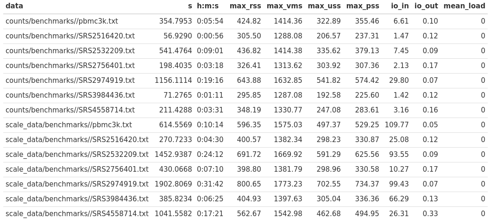

# sccaf_bench

## Description

## Conda: settings

```{buildoutcfg}
conda create -n sccaf scaaf scanpy=1.4.6 pandas numpy seaborn scikit-learn snakemake -c bioconda -c conda-forge -c anaconda
conda activate sccaf
```

## Pipeline: settings

Put your `assay=SCT, slot=counts` h5ad file after Seurat processing in `counts/data` directory, and put `assay=SCT, slot=scale.data` data
in `scale_data/data` directory

Add file prefixes (all symbols before `.h5ad`) to `SAMPLES` list in *Snakefile*

## Pipeline: run
**-j**: Use at most N CPU cores/jobs in parallel. If N is omitted or 'all', the limit is set to the number of available CPU cores.
```
snakemake -j 2
```

## Output

There are some out folders:

* `counts/benchmarks/sample.txt` -- benchmark for certain sample
* `counts/logs/sample.txt` -- log file for certain sample
* `counts/plots/before.png` -- UMAP plot with seurat clusters as labels
* `counts/plots/after.png` -- UMAP plot with sccaf clusters as labels

The same structure in `scale_data` folder

## Benchmark (optimal resolution finding is the most time-consuming step)



## Presentations

* assay = SCT, slot = counts: [link](https://docs.google.com/presentation/d/1Au-ZTQW_Nb5UQIO69MSGjsocjZgxqGrbbqQSp-QzXa0/edit?usp=sharing)
* assay = SCT, slot = scale.data: [link](https://docs.google.com/presentation/d/1Au-ZTQW_Nb5UQIO69MSGjsocjZgxqGrbbqQSp-QzXa0/edit?usp=sharing)